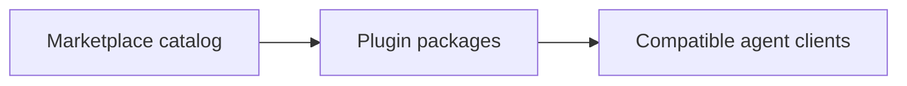

# Architecture

This document provides a high-level overview of the **v41e Plugins repository**
architecture.

## 1. High-Level System Overview

## 2. Core Components

### 2.1. Public Marketplace

- **Technology**: Codex marketplace JSON metadata.
- **Responsibility**: distribute public plugins from one Git repository.
- **Key interactions**: resolves catalog entries to packages under `plugins/`.

### 2.2. Plugin Packages

- **Technology**: Agent Plugins v1 packages with optional client compatibility metadata.
- **Responsibility**: own each plugin's manifests, skills, documentation, and behavior.
- **Key interactions**: compatible clients load the selected package; package
  details remain inside its owning directory.
- **Versioning**: every plugin manifest shares the repository version.

### 2.3. Skill Contracts

Skills are callable entrypoints. Modes select alternative operations; workflows
order lifecycle phases; phases define one step and its transition gate. Each
uses `Input`, `Workflow`, `Output`, and `Rules`, with routing sections where
selection is needed.

Platform adapters map logical concepts to concrete tools, commands, and remote
surfaces. Integration adapters map observed conditions to installed skills.
Their mappings preserve the selected operation's scope and approval gates.
Target references describe destination structure and templates.

## 3. Data Stores

This repository has no data store.

## 4. Technologies

- **Distribution metadata**: Agent Plugins v1 and Codex marketplace JSON.
- **Documentation and skills**: Markdown.
- **Runtime**: none at the repository root.

## 5. Deployment & Infrastructure

- **Distribution**: public Git repository containing installable plugin packages.
- **Codex delivery**: marketplace catalog under `.agents/`.
- **Other clients**: direct installation from a compatible package under `plugins/`.
- **Cloud provider**: none.
- **CI/CD**: GitHub Actions validates repository metadata and pull-request
  titles, and applies the shared stale-item policy. Release Please opens version
  pull requests against `main`; merging one creates a `vX.Y.Z` tag and GitHub
  Release without publishing to a package registry.

## 6. Security Considerations

- Repository contents are public; private maps, credentials, and personal facts
  must remain outside it.
- Marketplace, manifest, and plugin changes affect the distributed trust surface
  and require review.

## 7. Development & Testing Environment

Validate repository metadata using the root [`AGENTS.md`](AGENTS.md) command.
Follow the owning plugin's `AGENTS.md` for package-level checks and
[`CONTRIBUTING.md`](CONTRIBUTING.md) for the repository workflow.

## 8. References

- [Agent Plugins](https://agent-plugins.org/).
