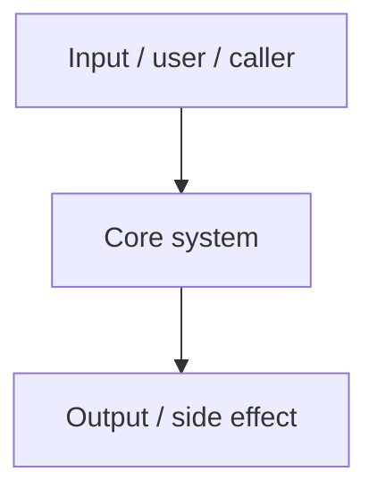

# Architecture

<!-- Keep all eight numbered sections and their numbering. Inapplicable sections may be empty or briefly marked not applicable. Remove authoring notes and unused example subsections. -->

This document provides a high-level overview of the **<!-- Project name -->** architecture.

## 1. High-Level System Overview

<!-- Explain system scope, major flows, and consequential design constraints. Add a Mermaid diagram only when it improves understanding; remove the placeholder if prose is enough. Add an optional Terminology subsection for unfamiliar domain terms or acronyms. Keep moving roadmap items in their tracker; describe accepted future constraints only when they affect the current design. -->

## 2. Core Components

<!-- Replace example component sections with real core components. Remove unused examples. -->

### 2.1. <!-- Component Name -->

<!-- Description of the component's responsibility. -->

- **Technology**: <!-- Runtime, framework, or service; link official docs matching the verified setup and include version or mode constraints only when they affect decisions -->
- **Responsibility**: <!-- What this component owns -->
- **Key interactions**: <!-- Reads from / writes to / invokes -->

## 3. Data Stores

<!-- Describe real persistence or state: databases, files, object storage, or relevant local state. If none exist, state that briefly and remove the example subsection. -->

### 3.1. <!-- Store Name -->

- **Technology**: <!-- e.g. PostgreSQL, DynamoDB -->
- **Purpose and ownership**: <!-- What state is held and which component owns it -->
- **Schema or lifecycle**: <!-- Relevant migration, format, retention, or regeneration contract; omit if inapplicable -->

## 4. External Integrations / APIs

<!-- For each external service or API, describe purpose, interaction method, and the owning contract/documentation. Prefer official Markdown or agent documentation matching the verified setup. Include material data ownership, trust, or failure constraints; link detailed security or component guidance rather than repeating it. If none exist, state that briefly. -->

## 5. Deployment & Infrastructure

<!-- Describe actual delivery: hosted services, applications, devices, package registries, or plugin distribution. If none exists, state that briefly and remove the example list. -->

- **Execution or distribution target**: <!-- e.g. AWS, browser, device, package registry -->
- **CI/CD**: <!-- e.g. GitHub Actions -->
- **Environments**: <!-- e.g. local, staging, prod -->
- **Operational notes**: <!-- sharp edges, approvals, manual steps -->

## 6. Security Considerations

<!-- Keep only security considerations that are actually relevant to this repository. If none exist, state that briefly and remove the example list. -->

- **Authentication**: <!-- e.g. OAuth2, Cognito -->
- **Authorization**: <!-- e.g. RBAC, IAM -->
- **Encryption**: <!-- e.g. KMS, TLS -->
- **Trust boundaries**: <!-- Relevant untrusted inputs, secrets, file access, or external calls -->

## 7. Development & Testing Environment

<!-- Explain material differences between development, test, and deployed/distributed environments. Link existing CONTRIBUTING.md or workflow docs for commands and verification rather than duplicating them. -->

## 8. References

<!-- A design source records why this architecture was chosen, such as a decision record or evaluated alternatives. List each verified source with the decision it explains; leave this section empty or briefly mark it not applicable when none is verified. Technology and API documentation belongs with the relevant component, store, deployment surface, or external integration. -->
